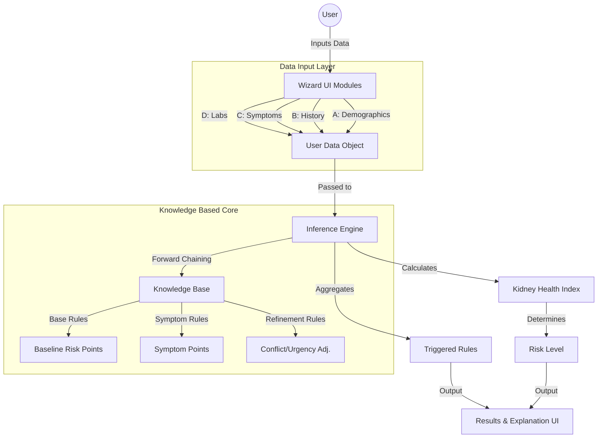

# Kidney Health Risk Checker - System Walkthrough

## Technical Architecture (ISP 543)

The system follows a modular Knowledge-Based System (KBS) architecture, separating the UI, Inference Engine, and Knowledge Base.

## Verification Results

### Logic Verification
The inference engine was tested with 4 distinct scenarios:
1.  **Healthy**: Score 0 (Low Risk)
2.  **Base Risk**: Score 50 (Moderate Risk)
3.  **Symptomatic**: Score 75 (High Risk)
4.  **Critical**: Score 100 (Critical Risk) 
All tests passed (see `src/logic/test.ts`).

### Application Features
- **Multi-step Wizard**: Smooth navigation through Demographics, History, Symptoms, Labs.
- **Weighted Point System**: Implemented ~50 base rules and ~150 symptom permutations support via the `knowledgeBase.ts` structure.
- **Explanation Module**: "Why this result?" dropdown lists exactly which rules contributed to the score.

### Verification Screenshots
#### Step 2: Medical History

#### Empty Page Issue Resolved
The application initially failed to load (blank page) due to a module export issue (`AgeGroup` type). This has been resolved, and the app now renders correctly.
